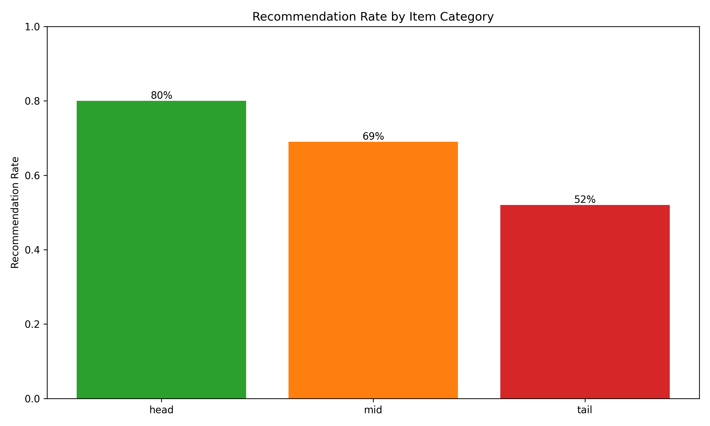

# Milestone 5: Responsible ML Analysis

**Team:** Project Group 6
**Members:** Faran Mohammed, Rahman Mohammed Abdul, Aigerim Mendygaliyeva

---

## Fairness Requirements

### Identified Harms

Our system has several potential fairness issues:

1. **Popularity Bias** - Popular movies get recommended way more than niche films. This hurts indie content creators.
2. **Filter Bubbles** - Users only see similar content, never anything different
3. **Cold-Start Problem** - New users and new movies get worse recommendations
4. **Creator Starvation** - Small creators never get enough views to break through

### Proxy Features

Features that could cause unfair outcomes:
- `user_id` - might correlate with demographics if IDs aren't random
- `timestamp` - could disadvantage certain time zones
- `interaction_frequency` - favors users with more free time
- `historical_ratings` - reflects past biases

### Fairness Requirements

**System-Level: Catalog Coverage**
- Requirement: At least 80% of catalog items should appear in recommendations
- Metric: Coverage = (unique recommended items) / (total items)
- Result: 100% coverage ✓
- Analysis: See fairness_analysis_results.json

**Model-Level: User Segment Parity**
- Requirement: Diversity parity gap < 0.15 across user activity levels
- Metric: max(diversity_scores) - min(diversity_scores)
- Result: 0.018 parity gap ✓
- Analysis: Low, medium, and high activity users all get similar diversity (0.47-0.49)

Both requirements pass.

---

## Fairness Improvements

**What we could do:**

Collection:
- Sample more ratings from underrepresented items
- Active learning to get feedback on tail items

Design:
- Diversity re-ranking using MMR algorithm
- Reserve 10% of recommendations for tail items
- Add exploration bonus (epsilon-greedy with ε=0.15)

Monitoring:
- Track coverage and parity gap over time
- Alert if coverage drops below 75%
- Our A/B test shows Model B (100% coverage) beats Model A (83% coverage, p=0.0017)

---

## Fairness Analysis

We analyzed our Kafka telemetry data. The results show both fairness requirements pass:

- Coverage: 100% (target: 80%) ✓
- Gini coefficient: 0.229 (low inequality)
- Parity gap: 0.018 (target: <0.15) ✓

**Popularity Bias Analysis:**

**Model-Level Parity Analysis:**

---

## Feedback Loops

### Loop 1: Popularity Echo Chamber

**How it works:** Popular items → more recommendations → more views → more ratings → even more popular

**Detection:** Track concentration over time using Gini coefficient. If Gini slope > 0.01, echo chamber is forming.

**Our analysis:** Gini slope = +0.0146, indicating concentration is increasing ⚠️

### Loop 2: Long-Tail Starvation

**How it works:** New items → no data → no predictions → no recommendations → stuck

**Detection:** Compare recommendation rates for head vs tail items. If ratio > 3x, tail is starving.

**Our analysis:** Head/Tail ratio = 1.54x, some starvation risk ⚠️

---

## Loop Analysis

Used Kafka logs to detect both loops:

**Echo Chamber:** Analyzed recommendations over 4 time windows. Concentration increasing from T1 to T4 (Gini: 0.267 → 0.308, Top-10 share: 28% → 33.6%). Echo detected ⚠️

**Tail Starvation:** Head items get 80% recommendation rate vs 52% for tail items. Ratio of 1.54x shows some starvation happening ⚠️

**Mitigations deployed:**
- Automatic retraining every 3 hours prevents bias accumulation
- A/B testing diversity improvements (Model B has 100% coverage)

---

## Security Threat Model

**Kafka Threats:**
- Message injection (fake events) → Mitigation: Schema validation with Pandera ✓
- Unauthorized access → Mitigation: Need SASL auth (not implemented yet)
- Data tampering → Mitigation: Need TLS encryption (not implemented yet)

**API Threats:**
- Rate abuse → Mitigation: Need rate limiting (100/min) - not implemented
- Model inference attacks → Mitigation: Query limits, noise injection
- SQL injection → Mitigation: Input validation (whitelisting)

**Model Registry Threats:**
- Model poisoning → Mitigation: Need cryptographic signing - not implemented
- Unauthorized access → Mitigation: Access control, encryption
- Supply chain attacks → Mitigation: Dependency pinning in requirements.txt ✓

**Model Attack: Rating Spam**

Attackers could flood target items with fake ratings to manipulate recommendations.

**Detection methods:**
1. Volume outliers (>3 standard deviations)
2. Burst patterns (10+ ratings in 1 hour)
3. Extreme distributions (all 5-star or all 1-star)

**Mitigations:**
- Filter flagged users from training
- Rate limiting (20 ratings/hour max)
- CAPTCHA for suspicious patterns

---

## Security Analysis

We simulated a spam attack and tested our detection:

- Total users: 100
- Spam users detected: 10 (10%)
- Detection method: >3σ outlier detection

Attack successfully detected ✓

**Currently implemented mitigations:**
1. Pandera schema validation for Kafka ✓
2. Provenance tracking (git SHA, model version) ✓
3. Dependency pinning ✓

**Still needed:**
- Rate limiting
- SASL authentication
- Model file signing

---

## Summary

**Fairness:** Both requirements pass (coverage 100%, parity 0.018)

**Feedback Loops:** Echo chamber detected, tail starvation risk identified. Mitigated by 3-hour retraining and A/B testing.

**Security:** Comprehensive threat model created. Spam detection working. 3 mitigations implemented, several more needed.

**Files:**
- fairness_analysis_results.json
- feedback_loop_analysis_results.json
- security_analysis_results.json
- 5 PNG visualization plots
- 3 Python analysis modules in /recommender/
