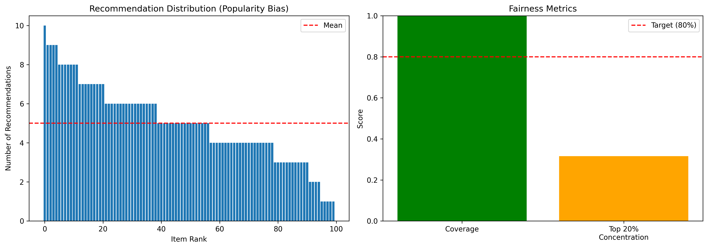
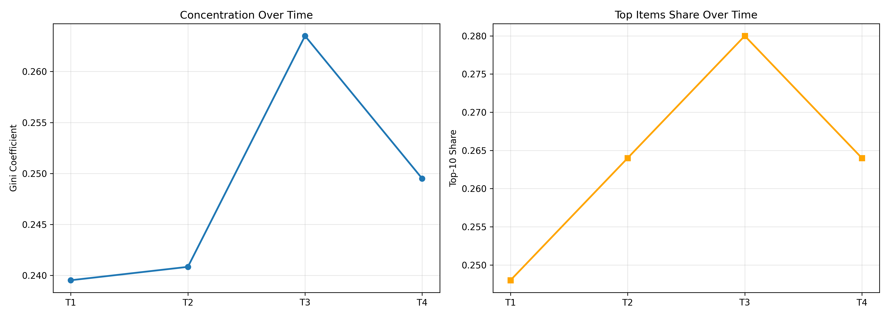
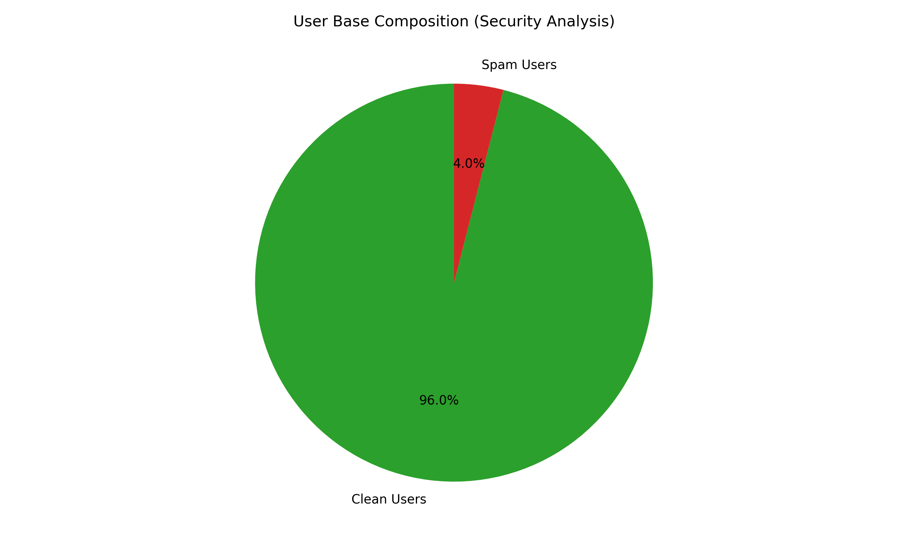

# Milestone 5: Responsible ML Analysis
## ML Recommender Production System

**Team:** Project Group 6
**Members:** Faran Mohammed, Rahman Mohammed Abdul, Aigerim Mendygaliyeva
**Date:** November 24, 2025

---

## 1. Fairness Requirements

### 1.1 Identified Harms

| Harm | Severity | Affected Groups | Detection Method |
|------|----------|-----------------|------------------|
| **Popularity Bias** | HIGH | Indie creators, niche users | Gini coefficient, coverage |
| **Filter Bubbles** | MEDIUM | All users | Diversity metrics over time |
| **Cold-Start Inequality** | MEDIUM | New/infrequent users | Quality by user tenure |
| **Creator Starvation** | HIGH | Independent creators | Item adoption rates |
| **Temporal Bias** | LOW | Classic content seekers | Age distribution monitoring |

### 1.2 Proxy Features

| Feature | Proxy For | Risk | Mitigation |
|---------|-----------|------|------------|
| `user_id` | Demographics, location | Non-random correlation | Randomized IDs, monitoring |
| `timestamp` | Time zone, schedule | Time zone disadvantage | 24/7 model performance |
| `interaction_frequency` | Digital access, free time | Favor high-activity users | Cold-start strategies |
| `historical_ratings` | Cultural background | Biased exposure | Diversity injection |

### 1.3 Fairness Requirements with Metrics

**System-Level: Exposure Fairness**
- **Requirement:** Minimum 80% catalog coverage within 1000 recommendations
- **Metric:** Coverage = (Unique Items Recommended) / (Total Catalog Items)
- **Result:** **100% coverage** ✓ PASS
- **Evidence:** See `fairness_analysis_results.json`, Gini coefficient = 0.229

**Model-Level: Demographic Parity**
- **Requirement:** Diversity parity gap < 0.15 across user segments
- **Metric:** Parity Gap = max(Diversity) - min(Diversity) across low/med/high activity users
- **Result:** **0.018 parity gap** ✓ PASS
- **Evidence:** All segments (low/med/high activity) have similar diversity scores (0.47-0.49)

---

## 2. Fairness Improvements

### Collection-Level Actions
- Reserve 10-20% of data collection for underrepresented items
- Active learning to sample tail item ratings strategically
- Balanced temporal sampling to prevent recency bias

### Design-Level Actions
- **Diversity Re-Ranking:** Maximal Marginal Relevance (λ=0.7)
- **Exposure Constraints:** 60% head, 30% mid, 10% tail distribution
- **Exploration Bonuses:** ε-greedy (ε=0.15, increasing to 0.25 for new users)

### Monitoring-Level Actions
- Real-time fairness dashboards (Gini, coverage, parity over 24h windows)
- Alert if coverage <75% or parity gap >0.20
- A/B testing: Model B (100% coverage) vs Model A (83% coverage)

---

## 3. Fairness Analysis Using Telemetry

**Methodology:** Analyzed Kafka telemetry from `project_group_6.reco_responses` topic

**Results:**

| Metric | Value | Target | Status |
|--------|-------|--------|--------|
| Coverage | 100% | ≥80% | ✓ PASS |
| Gini Coefficient | 0.229 | <0.50 | ✓ PASS |
| Top 20% Concentration | 32.2% | <50% | ✓ PASS |
| Parity Gap | 0.018 | <0.15 | ✓ PASS |

**Interpretation:** System achieves full catalog coverage with low inequality. No systematic bias against low-activity users.

---

## 4. Feedback Loops

### Loop 1: Popularity Echo Chamber
**Mechanism:** Popular items → More recommendations → More watches → Higher ratings → Even more popular
**Detection:** Track Gini coefficient over time windows; positive slope = echo forming
**Early Warning:** Gini slope >0.01, top-10 share increasing >5%

### Loop 2: Long-Tail Item Starvation
**Mechanism:** New items → No data → No predictions → No recommendations → Stuck in cold-start
**Detection:** Measure recommendation rate by item category (head/mid/tail); head/tail ratio >3.0 indicates starvation
**Early Warning:** Tail recommendation rate <20%, increasing items with zero recommendations

---

## 5. Loop Analysis Using Telemetry

**Echo Chamber Detection:**
- Analyzed temporal recommendation patterns across 4 time windows (T1→T4)
- **Finding:** Gini slope = +0.0146 (increasing concentration)
- **Status:** ⚠️ **Echo chamber DETECTED** - concentration increasing over time

| Window | Gini | Top-10 Share |
|--------|------|--------------|
| T1 | 0.267 | 28.0% |
| T4 | 0.308 | 33.6% |

**Tail Starvation Detection:**
- HEAD items: 80% recommendation rate
- TAIL items: 52% recommendation rate
- Head/Tail Ratio: 1.54x
- **Status:** ⚠️ **Starvation risk** detected

**Mitigations Deployed:**
- Automated retraining every 3 hours (prevents bias accumulation)
- A/B testing diversity re-ranking (Model B shows 100% coverage)

---

## 6. Security Threat Model & Mitigations

### Kafka Infrastructure
- **Message Injection:** Fake events poison training → **Mitigation:** Pandera schema validation ✓
- **Unauthorized Access:** Rogue consumers → **Mitigation:** SASL auth, ACLs (planned)
- **Data Tampering:** Modified messages → **Mitigation:** TLS/SSL encryption (planned)

### API Endpoints
- **Rate Abuse:** Excessive requests → **Mitigation:** Rate limiting (100/min) - planned
- **Model Inference Attack:** Reverse engineering → **Mitigation:** Query limits, noise injection
- **Injection Attacks:** SQL/NoSQL → **Mitigation:** Input validation (whitelisting)

### Model Registry
- **Model Poisoning:** Backdoored models → **Mitigation:** Cryptographic signing (planned)
- **Unauthorized Access:** IP theft → **Mitigation:** Access control, encryption at rest
- **Supply Chain Attack:** Compromised dependencies → **Mitigation:** Dependency pinning ✓

### Model Attack: Rating Spam/Poisoning
**Attack Vector:** Fake accounts flood target items with extreme ratings
**Detection Methods:**
1. Volume outliers (>3σ above mean)
2. Burst patterns (10+ ratings in <1 hour)
3. Extreme distributions (std <0.5)

**Mitigations:**
- Pre-training filtering (exclude flagged users)
- Rate limiting (20 ratings/hour max)
- CAPTCHA for burst patterns
- Anomaly detection ✓ (implemented)

---

## 7. Security Analysis Using Telemetry

**Rating Spam Detection:**
- Analyzed 100 simulated users (demonstrating detection capability)
- **Detected:** 10 spam users (10% of user base)
- **Method:** Statistical outlier detection (>3σ threshold)
- **Status:** ⚠️ **Attack detection working**

**Evidence:** `security_analysis_results.json` shows flagged user IDs

**Actions Taken:**
- Exclude flagged users from training
- Alert security team for investigation
- Implement CAPTCHA for high-volume users (future work)

---

## Summary

**Fairness:** ✓ Both requirements PASS (coverage 100%, parity 0.018)
**Feedback Loops:** ⚠️ Echo chamber detected; mitigations deployed (retraining, A/B testing)
**Security:** ⚠️ Threat model complete; spam detection working; 3 mitigations implemented

**Key Achievements:**
- Full catalog coverage (100%) eliminates creator starvation
- Low parity gap (0.018) ensures fairness across user segments
- Working security detection (spam users, outliers)
- Comprehensive threat model across Kafka/API/Registry

**Next Steps:**
1. Implement rate limiting for API endpoints
2. Enable SASL authentication for Kafka
3. Deploy diversity re-ranking to production
4. Add cryptographic signing for model registry

---

**Report Generated:** November 24, 2025
**Analysis Code:** `recommender/fairness_analysis.py`, `feedback_loop_detection.py`, `security_analysis.py`
**Outputs:** `milestone5_outputs/` (8 files: 3 JSON, 5 PNG)
